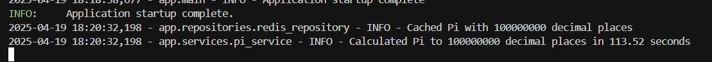
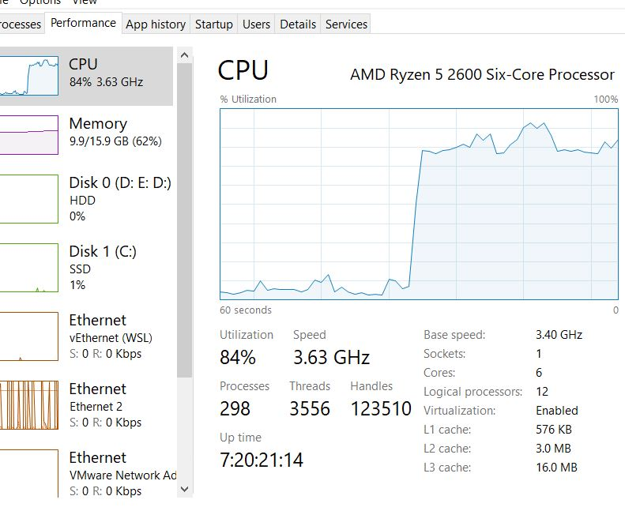

# Pi Quests
A collection of apps that related to calculation of Pi precesion.

Backend - A Python HTTP server that calculate Pi in increasing precision fashion.


Frontend - A Next.js web app that showcase the Sun in 3D model and some other info. Retrieve the Pi value from Backend.

<div align="center">
    
</div>


## 📖 Overview

The main objective of this project is to compute Pi to arbitrary precision in increasing decimal places(e.g. 3, 3.1, 3.14, 3.141, 3.1415...). The frontend app serves as a client application that consumes the computed Pi.

## 🏗️ Architecture

The application consists of three main components:

1. **FastAPI Backend(Python)**
   - Implements the Chudnovsky algorithm for calculating Pi with binary splitting and CPU Parallelism
   - Uses `mpmath` (backended with `gmpy2`) for arbitrary precision arithmetic
   - Caches calculated values in Redis
   - Provides a RESTful API for Pi retrieval
   - Simple route guard with API Key and rate limit.
   - Containerized with Docker

2. **Next.js Frontend**
   - Simple prototyping with Next.js, R3F, TailwindCSS and shadcn-ui
   - 3D sun model - basic interaction, camera view control
   - Unit switching between kilometers and miles
   - Modal dialog for viewing Pi(fetch from backend) with high precision

3. **Redis Cache**
   - Stores calculated Pi values
   - Enable resume calculation from previous calculated precision.

## 🚀 Getting Started

### Prerequisites

- [Docker](https://www.docker.com/get-started) 
- [Python 3.9+](https://www.python.org/downloads/) (for local backend development)
- [nodejs 18+](https://nodejs.org) (for local frontend development)
- [pnpm](https://pnpm.io/installation) (recommended for frontend development)

### Using Docker (Recommended)

The easiest way to run the entire application stack:

```bash
# Clone the repository
git https://github.com/jjteoh-thewebdev/pi-quests.git
cd pi-quests

# (Optional) Update frontend/.env.docker and backend/.env.docker accordingly

# Start the application stack
docker-compose up -d
```

The application will be available at:
- Frontend: http://localhost:3000
- Backend API: http://localhost:8000

### Local Development

- create .env file

    ```bash
    cp backend/.env.sample backend/.env
    cp frontend/env.sample frontend/.env.local
    ```

#### Backend

```bash
cd backend

# Create a virtual environment
python -m venv venv
source venv/bin/activate  # On Windows: venv\Scripts\activate

# Install dependencies
pip install -r requirements.txt

# Install system dependencies for gmpy2
# Ubuntu/Debian:
sudo apt apt-get update
sudo apt install libgmp-dev libmpfr-dev libmpc-dev

# Set up environment variables
cp .env.sample .env
# Edit .env with your settings

# (Optional) Start Redis with Docker, or you can install natively to you machine
docker run -d -p 6379:6379 redis:alpine

# Run the backend
uvicorn app.main:app --reload
```

#### Frontend

```bash
cd frontend

# Install dependencies
pnpm install

# Set up environment variables
cp env.sample .env.local
# Edit .env.local with your settings

# Start the development server
pnpm dev
```

## 📋 API Documentation

Once the backend is running, Swagger documentation is available at:
- http://localhost:8000/docs

## 💡 Key Features

- **High-Precision Calculation**: Uses the Chudnovsky algorithm for rapid Pi calculation
- **Parallelized Processing**: Multi-core support for faster calculations
- **Progressive Enhancement**: Incrementally calculates Pi to higher precision in the background
- **Caching Layer**: Redis caching prevents recalculating already-known digits

Compute 100M decimal places on my machine took 113.52 seconds:



PC spec and CPU utilization


*I only have 16G RAM, 100M is the max I can push.


## ⚙️ Configuration

### Backend Environment Variables

- `API_KEY`: API key for authentication
- `MAX_DECIMAL_POINTS`: Maximum decimal places to calculate (default: 10000)
- `START_DECIMAL_POINTS`: Start from decimal points (default from 0)
- `REDIS_URL`: Redis connection string

### Frontend Environment Variables

- `API_BASE_URL`: Backend API URL
- `API_KEY`: API key for authentication

## 🤔 Limitations & Future Work

### Current Limitations

- High precision calculations are memory-intensive(my 16GB can only push up to 100M decimal points)
- Low level languages like C or RUST has better performance than Python.

### Future Enhancements

- Use disk storage for caching, current implementation restricted to RAM size.
- Use `gmpy2`(C libraries) directly. Current implementation using a pure Python wrapper(`mpmath`) to handle arbitary precision calculation.

## 🔒 Security Notes

- The default setup is for development; additional security measures should be implemented for production. 
- More robust API Key management should be implemented. 

## 📄 License

[MIT License](LICENSE)

## 🙏 Resources

Pi
- https://en.wikipedia.org/wiki/Pi

Chudnovsky algorithm 
- https://www.craig-wood.com/nick/articles/pi-chudnovsky/
- https://en.wikipedia.org/wiki/Chudnovsky_algorithm 

mpmath - for arbitrary precision arithmetic
- https://mpmath.org/ 